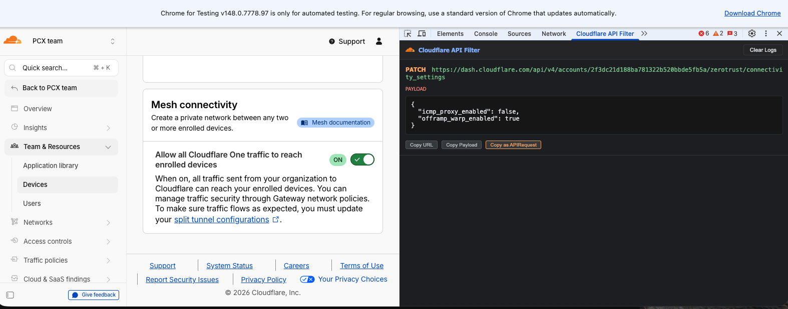

# dash-to-api

A Chrome DevTools extension that intercepts Cloudflare dashboard API requests and converts them into [`<APIRequest />` component](https://developers.cloudflare.com/style-guide/components/api-request/) snippets for use in Cloudflare developer documentation.

## What it does

When you interact with the Cloudflare dashboard, the extension captures `/api/v4/` network requests to accounts and zones and displays them in a dedicated DevTools panel. Each request card shows:

- The HTTP method and full URL
- The request payload (for POST, PUT, PATCH, DELETE)
- Copy buttons for the URL, payload, and a formatted `<APIRequest />` component



The `<APIRequest />` output replaces IDs in the path with named placeholders:

| URL path | Output |
|---|---|
| `/accounts/abc123.../` | `/accounts/{account_id}/` |
| `/zones/def456.../` | `/zones/{zone_id}/` |
| `/devices/policy/0c5c11f9-8f8d-...` | `/devices/policy/{policy_id}` |
| `/rulesets/abc.../rules/def...` | `/rulesets/{ruleset_id}/rules/{rule_id}` |

Query parameters and JSON payloads are included in the component output as `params` and `json` props.

## Prerequisites: Chrome for Testing

Corporate-managed Chrome instances block custom extensions. To load this extension, use [Chrome for Testing](https://developer.chrome.com/blog/chrome-for-testing), a separate Chrome build that allows unpacked extensions.

### Download

1. Go to the [Chrome for Testing dashboard](https://googlechromelabs.github.io/chrome-for-testing/).
2. Find the **Stable** channel row and copy the download URL for your OS.
3. Paste the URL into a browser tab to start the download.
4. Unzip the downloaded folder.
5. Open `Google Chrome for Testing.app` from the unzipped folder.

### macOS: trust the app

macOS flags downloaded apps as untrusted. To remove the quarantine flag:

1. Open Terminal.
2. Type the following command, but do not press Enter yet:
   ```sh
   sudo xattr -cr 
   ```
3. Drag the `Google Chrome for Testing.app` from Finder into the Terminal window (this fills in the file path). The full command should look like:
   ```sh
   sudo xattr -cr /path/to/chrome-mac-arm64/Google\ Chrome\ for\ Testing.app
   ```
4. Press **Enter** and provide your password.

After that, open `Google Chrome for Testing.app` from the unzipped folder.

## Install the extension

1. Clone or download this repo.
2. Open Chrome for Testing and type `chrome://extensions/` in the address bar.
3. Turn on **Developer mode** (top right).
4. Select **Load unpacked** and select this directory.

## Update the extension

1. Pull the latest changes from remote or make changes to the repo locally.
2. Go to `chrome://extensions/` in Chrome for Testing.
3. Select the reload icon on the **Cloudflare API Filter** card.
4. If DevTools was already open, close the DevTools panel and reopen it to load the updated extension.

## Usage

1. Open Chrome for Testing.
2. Open Chrome DevTools (F12 or Cmd+Opt+I).
3. Select `>>` to show all tabs, then select the **Cloudflare API Filter** tab.
4. Navigate to the [Cloudflare dashboard](https://dash.cloudflare.com/). Requests appear in the panel as they happen.
5. Select **Copy as APIRequest** to copy the formatted component to your clipboard.